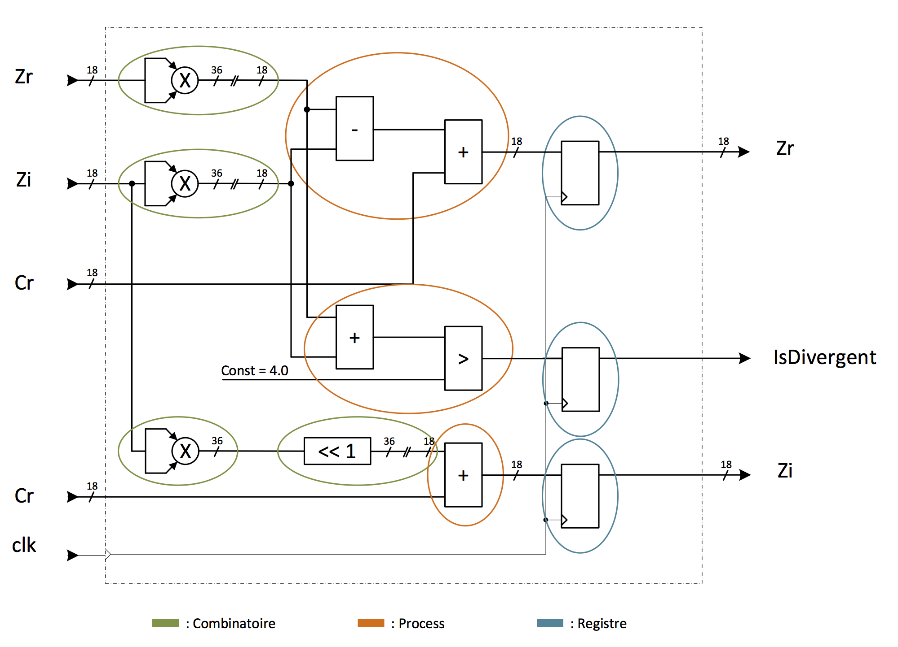
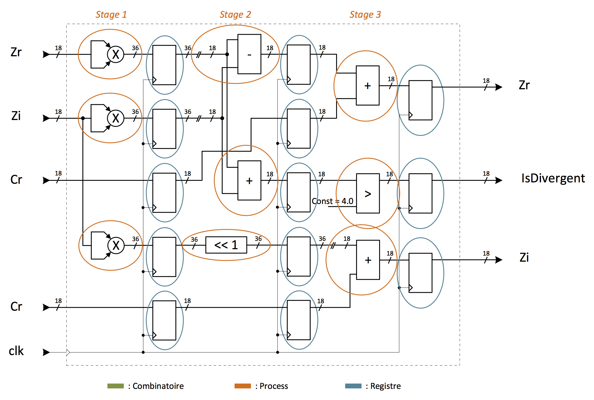

.. _calc_mandelbrot:

Calculateur Mandelbrot
======================

Dans un premier temps, une version basique du calculateur a été développée afin d'obtenir une base améliorable par la suite. Ce calculateur est décomposé en trois blocs avec le calculateur de nombre complexe pour chaque itération, un compteur du nombre d’itérations et une machine d’état gérant les deux autres blocs.
Le calculateur de nombre complexe permet de calculer une itération unique et indique si le résultat est divergent. Cette version effectue le calcul de manière combinatoire. Ensuite, les résultats sont enregistrés dans un des registres. Le calcul de multiplication est défini en VHDL sans utiliser les blocs dédiés de Xilinx (DSP48E1). Lors de la synthèse, il est possible de voir que les multiplications utilisent bien les DSP48E1 lors de la synthèse/implémentation.

	Schéma de la version sans pipeline

Pour valider le bloc du calculateur de nombre complexe, un banc de test permettant de contrôler son comportement a été mis en place. Les données utilisées pour valider le fonctionnement proviennent d'un script qui calcule les résultats de différentes itérations.

Un deuxième banc de test permet de contrôler l'IP de génération de la fractale. La validation de celui-ci utilise quelques points générés par un script Python qui générer une fractale Mandelbrot complète.

La vitesse de fonctionnement de ce bloc de calcul est d'environ 115MHz. Par sécurité, la vitesse maximale a été fixée à 110MHz.

Une deuxième version a été implémentée afin de pouvoir tester la vitesse maximale avec la version pipeliné avec trois étages de registre. Cette modification permet de raccourcir le temps de propagation et ainsi augmenter de manière significative la fréquence. En revanche, cette modification nécessite 3 clocks pour obtenir une valeur en sortie du bloc de calcul de nombre complexe. Cette amélioration permet de calculer trois points en parallèle. 

Cette version améliorée n'a pas été implémentée définitivement dans le top-level, car le temps imparti était trop court, mais cela donne une idée de possibilité d'amélioration.

	
	Schéma de la version pipeline

La fréquence maximale de cette nouvelle version permet de fonctionner à environ 360MHz, et ce en traitant 3 points en parallèle.

