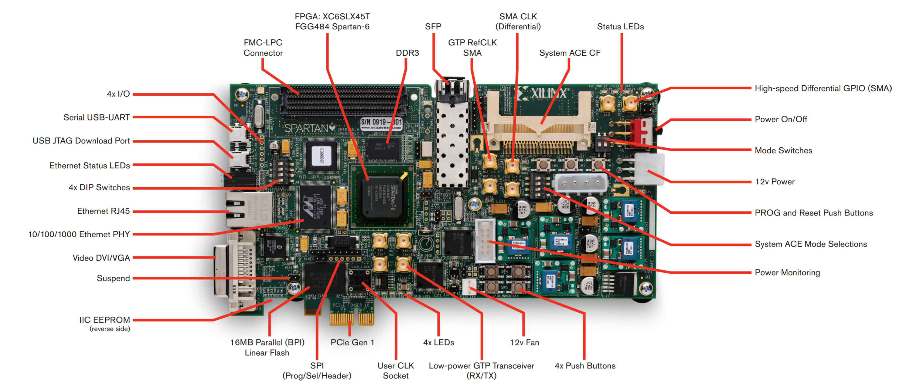

Introduction
============

Ce projet a pour finalité de calculer un fractale de Mandelbrot. Le but tout au long de ce projet et d'étudier les optimisations qui peuvent être faite afin d'accélérer la logique généré par le VHDL.

Le projet cible la carte SP605 de Xilinx (:numref:`fig_sp605`). 

.. _fig_sp605:

	
	Carte SP605 de Xilinx

Cette carte embarque une FPGA Spartan 6 (XC6SLX45T) ainsi que plusieurs périphériques tel que :

 - Sortie DVI
 - Mémoire DDR
 - Interface Ethernet et SFP (Fibre optique).
 - Interface PCIe.
 - Connecteur FMC.

Dans ce projet, nous utiliserons la sortie DVI afin d'afficher une fractale de Mandelbrot sur un écran. 

Dans un deuxième temps, nous tenterons sans succès d’utiliser la mémoire DDR pour agrandir l'image.