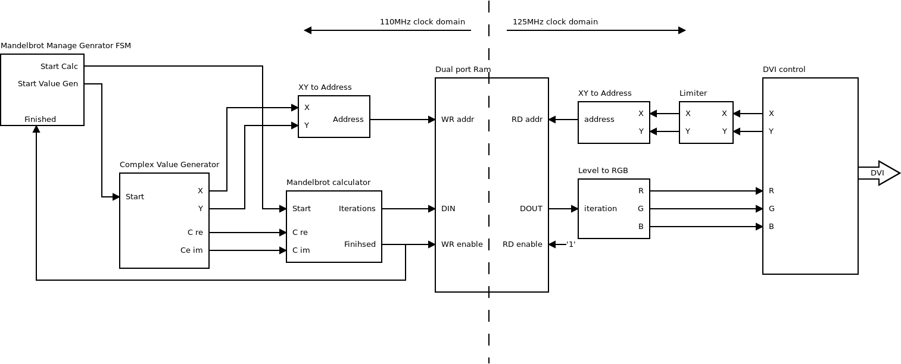
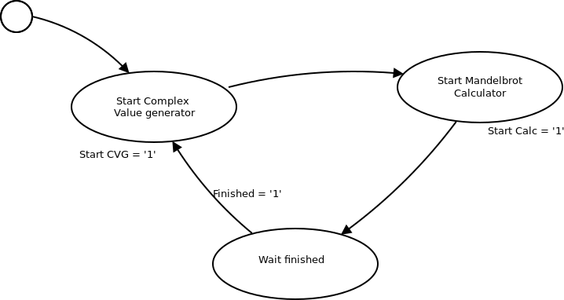
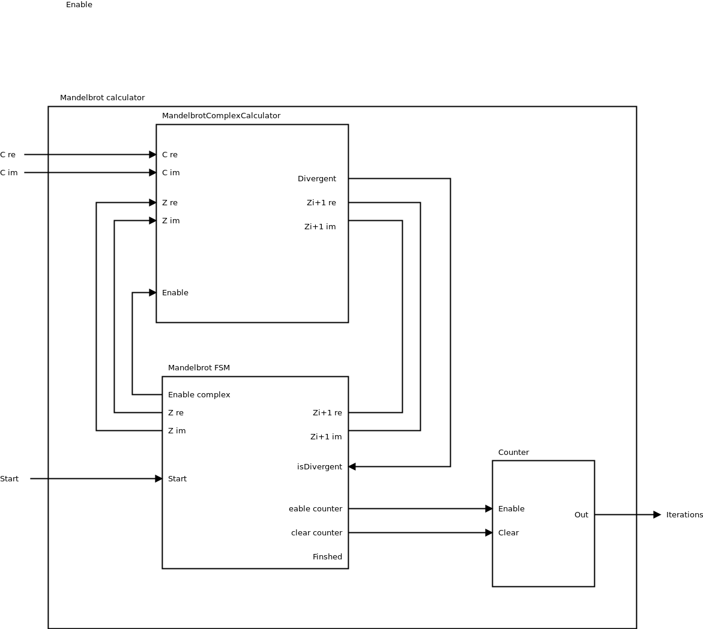

Top-Level
=========

L'architecture principale de notre système peut être vue à la :numref:`fig_top_level`. 

.. _fig_top_level:

	Top-Level

Notre système s'articule autour d'une RAM à deux interfaces ("Dual port RAM"). Une interface est utilisée pour la lecture alors que la seconde est utilisée pour l'écriture. Les données de chaque pixel de la fractale sont stockées à l’intérieur de cette RAM. Du côté de l'interface de lecture, nous trouvons la logique qui permet de transférer les données de la RAM à l'interface DVI. Sur l'interface d'écriture se trouve la logique qui permet de générer les données de la fractale. Chaque bloc se trouve détaillé ci-dessous.

Le système travaille sur deux horloges différentes. La dual-port RAM permet ceci, car elle utilise une fréquence d'horloge par port. La génération des données est cadencée à 110MHz. La partie DVI est cadencée par le bloc "*DVI control*" qui fournit un signal d'horloge à 125MHz.

Génération des données
----------------------

Du côté de la génération des données, tout est orchestré par le bloc "*Mandelbrot ManageGenerator FSM*". Ce bloc est une machine d'état qui attend que le calcul de la valeur de Mandelbrot soit terminé, puis elle demande au Générateur de nombre complexe la valeur suivante en mettant son entrée ``Start`` à 1 et finalement démarre le calcul de la valeur du pixel effectué par le bloc "*Mandelbrot calculator*" selon la nouvelle coordonnée complexe. Cette machine d'état peut être vue dans la :numref:`ManageGenerator_FSM`. 

.. _ManageGenerator_FSM:

	Mandelbrot ManageGenerator FSM	

Le bloc "*Complex Value Generator*" génère une nouvelle coordonnée complexe ainsi que les coordonnées X et Y correspondants à chaque fois que son signal d'entrée ``Start`` est mis à 1. La coordonnée complexe est générée dans un plan complexe allant de -2-i à 1+i, incrémenté de 3/512 dans le sens des réels et de 2/512 dans la direction complexe. La coordonnée complexe est décomposée en une valeur réelle et une valeur imaginaire sur deux signaux, ``C_re`` et ``C_im``. Ces nombres sont représentés en valeur à virgule fixe de 16 bits avec la partie entière sur 4 bits. Ce format a été choisi, car il permet de mettre la valeur la plus extrême, soit 2, au carré sans débordement ni perte de bit de signe. En effet :math:`2^2=< 2^{4-1}`. 1 LSB vaut 1/4096 (env 0.000244). Pour chaque coordonnée complexe générée, une coordonnée X et Y est générée, avec le point X,Y=0,0 équivalent à la coordonnée complexe -2+i, soit le coin supérieur gauche de l'image. L'incrément en X et Y est de 1. Y est incrémenté quand X atteint 512. Ces coordonnées sont celles du pixel sur l’écran correspondant à la coordonnée complexe.

Chaque coordonnée complexe est reçue par le bloc "*Mandelbrot Calculator*". Ce bloc calcule la valeur de Mandelbrot en fonction de la coordonnée complexe. Ce bloc intègre une petite machine d'état qui démarre l’itération de la valeur de calcul lorsque le signal ``Start`` est mis à 1. Cette machine d'état arrête l’itération lorsque la valeur à Zi a divergé (>2) ou lorsque le nombre d’itérations maximum est atteint. Lorsque l'une de ces 2 conditions est remplie, la sortie ``Finished`` passe à 1. La sortie ``itération`` représente le nombre d’itérations et évolue au cours du temps. Elle est remise à zéro lorsque ``Start`` est actif.

Le schéma interne de ce bloc peut être vue dans la :numref:`mandelbrot_calculator`. 

.. _mandelbrot_calculator:

	Mandelbrot calculator 

Ce bloc est composé de trois parties:

 - Le bloc "*MandelBrotComplexCalculator*" calcule une itération du calcul de Mandelbrot. Ce bloc est détaillé dans le chapitre ":ref:`calc_mandelbrot`".
 - Le bloc "*Mandelbrot FS: M*" est une machine d'état qui supervise le calcul.
 - Un simple compteur sur 7 bits.

La machine d'état "*Mandelbrot FSM*" est dessinée à la :numref:`mandelbrot_fsm`. 

.. _mandelbrot_fsm:
.. figure:: figures/Mandelbrot_FSM.png
	:scale: 80%

	Machine d'état pour le calcul de Mandelbrot 

Elle comporte 4 états:

:Wait: Attend le signal de démarrage de la machine d'état "*Mandelbrot ManageGenerator FSM*"
:Load: Charge les données initiales dans le bloc de calcul et remises à zéro du compteur
:Calculate: Itération de Mandelbrot par le bloc de calcul.
:Finished: Fin du calcul. Soit par divergence signalée par le bloc de calcul, soit par nombre d’itérations maximum atteint.

Le bloc "*XYtoAddress*" se charge de convertir les coordonnées Y et X en adresse pour la RAM.  Cela se fait simplement en concaténant la coordonnée Y et X.

Finalement, la sorte du bloc "*Mandelbrot Calculator*" et "*XYtoAddress*" sont utilisés pour piloter la RAM. L'adresse est donnée par le bloc "*XYtoAddress*", la donnée par la sorite ``itération`` du bloc "*Mandelbrot Calculator*", et le signal "Write enable" qui permet d'activer l'écriture en RAM est piloté par le signal ``Finished`` fourni par le bloc "*Mandelbrot Calculator*".

Lecture des données
-------------------

L'autre interface de la RAM est utilisée pour lire les données. La lecture est orchestrée par le bloc "*DVI Ctrl*". Ce bloc était fourni au début du projet. Ce bloc pilote l'interface DVI et fournit une horloge à 125MHz. À chaque coup d'horloge, le bloc fournit une coordonnée X et Y. La logique connectée doit fournir en retour une valeur de couleur au format RGB, soit une intensité de rouge, vert et bleu. Trois signaux sont à disposition à cet effet.

Le coordonnée en X et Y sont passé au travers d'un bloc "*limiter*" qui se charge de limiter l'amplitude à la taille de l'image générée. La RAM ne permettant de stocker qu'une image de 512 pixels par 512 pixels, l'image est mise à l'échelle. À chaque coordonnée X et Y fournie par le bloc "DVI Ctrl" correspond 4 pixels de l'image générer. Cela est simplement fait en décalant les coordonnées X et Y vers la droite, supprimant le bit de poids faible.

Le bloc "*YX to Ram*" est identique à celui utilisé pour la génération. Cela permet de s'assurer de la consistance des données. La sortie de ce bloc permet de piloter l'adresse de la RAM.

Le signal "Read enable" qui permet d'activer la lecture est mis de manière permanente à 1. Ce circuit est temporisé par l'horloge à 125Mhz fournie par le bloc "*DVI Ctrl*". À chaque coup d'horloge, une nouvelle donnée est donc lue.

Les données lues sont passées dans un bloc qui convertit le nombre d’itérations (valeur entre 1 et 100) stocké dans la RAM en niveau de gris. Cela est fait en décalant vers la gauche la valeur cette valeur, puis en répliquant cette valeur pour les canaux rouge, vert et bleu.

